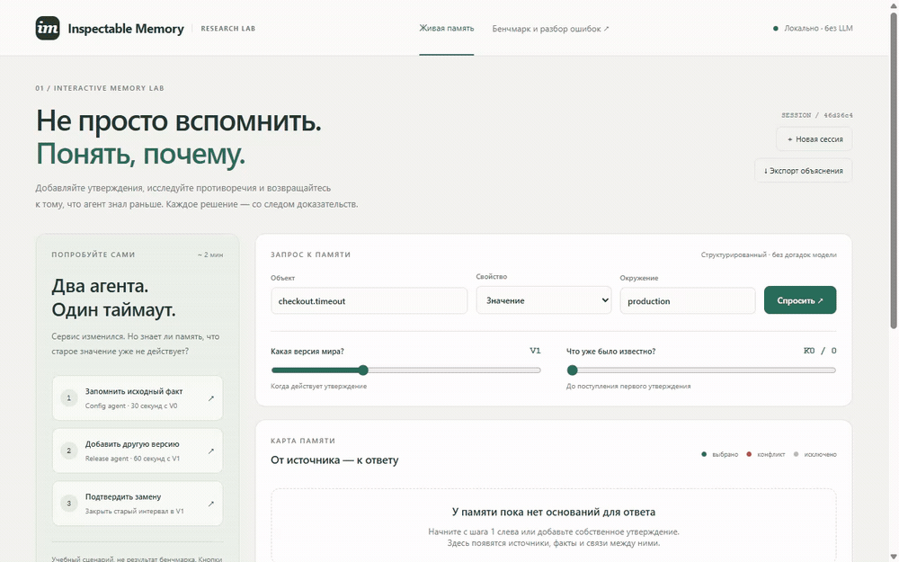

# Inspectable Memory: standalone AAAI Demo artifact

Code and reproducibility materials for **Inspectable Memory for Code Agents:
An Interactive System for Retrieval and Error Analysis**.

[Paper repository](https://github.com/nicl-nno/AAAI2026_Demo_AgentMemory)

The interactive demo runs locally using Python's standard library and SQLite.
It needs no API key, model download, database service, plugin, or session hook.
Code-graph reconstruction additionally uses NumPy. The LoCoMo experiment is
fully model-free, including indexing and answering.



## Start the demo

Python 3.11–3.13 is supported; 3.13 was used for release verification.

```bash
git clone https://github.com/nicl-nno/aaai2026_demo_agentic_memory_code.git
cd aaai2026_demo_agentic_memory_code
python python/inspectable_demo.py
```

Open **http://127.0.0.1:8765**. The server binds to loopback only. Its writable
journal is `.inspectable/demo.sqlite`; it does not modify the bundled fixture.
Use `--port` and `--database` to run an isolated instance.

The landing page is a **live safety gate for a destructive code change**. A code
agent proposes `DROP COLUMN users.legacy_token` from an approved cleanup ticket,
but a later production trace shows that an emergency rollback restored an active
reader. Inspect the conflict and explicitly confirm the rollback before the
system blocks the merge. The graph, answer and provenance inspector are
computed from real SQLite writes, not precomputed responses. Two sliders
independently control valid snapshot and knowledge cutoff. Custom assertions,
explicit negation,
environment isolation, historical recall and JSON trace export are supported.
Each workspace persists under its URL; creating another does not delete it.

The guided database-migration example is authored. Agent names label sources;
no actual LLM agent or free-text extraction runs. The interface explains
selection rules and source evidence, not model reasoning. Visit `/replay` for the unchanged
LongMemCode and controlled source-derived temporal examples. The LoCoMo companion
remains an offline experiment, not a separate implemented UI panel.

See [the guided demo script](docs/live-demo.md). The live service is
**loopback-only, single-user research software**, not an authenticated public
multi-user deployment. The URL workspace ID is a convenience, not an access
control mechanism. Do not expose the port directly to the Internet.

## Install evaluation dependencies and test

Using [uv](https://docs.astral.sh/uv/):

```bash
uv sync --frozen
uv run --frozen python -m pytest -q
```

Alternatively create your own virtual environment and install `numpy` and
`pytest`. The committed `uv.lock` records the verified dependency versions.
Tests include real SQLite save/save/recall, real HTTP, immutable replay,
participant/time guards, and all 425 code ranking comparisons. No live LLM
or database endpoint is contacted by the test suite.

## Reproduce the article

| Result | Command | What is recomputed |
|---|---|---|
| Temporal correctness | `uv run python experiments/evaluate_inspectable_memory.py --output outputs/temporal.json` | Fresh SQLite journal, 36 authored states under four rule settings |
| Source-backed code ranking | `uv run python experiments/reproduce_code.py` | Graph from public source/SCIP, BM25, structural signals and RRF; dense fallback **rank order is recorded input** |
| New model-free code variant | `uv run python experiments/reproduce_code.py --fresh-bm25 --output outputs/code-bm25.json` | All retrieval from source and lexical index; no recorded dense channel, therefore a different experiment |
| LoCoMo preparation | `uv run python experiments/download_locomo.py` | Download and SHA-256 verification of the pinned public dataset |
| LoCoMo, 17 profiles | `uv run python experiments/locomo_context_eval.py --output outputs/locomo --repeats 3` | Fresh ingestion, retrieval, narrow calendar reader, then scoring |
| LoCoMo paper comparison | `uv run python experiments/verify_locomo_reference.py --output outputs/locomo` | Source/artifact integrity, exact 33,762 top-5 lists, per-category metrics and paired results |

The temporal command creates its output directory. LoCoMo's output directory
must **not** already exist; use a new directory for a new run.
The full three-repeat run usually takes several minutes. No raw LoCoMo dataset
is committed; review its [upstream terms](https://github.com/snap-research/locomo)
before downloading or redistributing it.

To rebuild the demo's source-backed candidate routes separately:

```bash
uv run python experiments/reproduce_code.py --fixture-output outputs/rebuilt-fixture.json
uv run python python/inspectable_demo.py --fixture outputs/rebuilt-fixture.json --database outputs/rebuilt.sqlite
```

The rebuilt fixture reuses the released task selection, authored temporal
schedule and historical reader observations. It does not generate new Luna
responses. Historical `gpt-5.6-luna` output is exposed only for its original
top-5; changed rankings never inherit it.

### Reference results and interpretation

- Temporal rules: exact selection **36/36**, versus **12/36** without temporal
  filtering. Six intended conflicts, zero false alarms with combined rules;
  conflict checks without time generate 24 false alarms. These are authored
  correctness tests, not measured gains on natural state changes.
- Code: all **425** graph top-5 lists reproduce their recorded reference.
  This is replay agreement, **not 425 solved tasks**. Retrieval passes 272/425;
  weighted score 0.7152, raw score 0.6977. It is not a fresh reconstruction of
  the recorded dense retriever, and no corresponding runtime claim is made.
- The independent `--fresh-bm25` run also achieves 272/425, weighted 0.7152 and
  raw 0.6977, but its exact top-5 matches only 398/425 historical lists. Equal
  aggregate quality does not mean identical rankings; this run is separate.
- LoCoMo: 10 conversations, 5,882 utterances, 1,536 ordinary questions with
  evidence, 446 adversarial questions analyzed separately. Four ordinary
  questions without evidence are excluded from evidence metrics.

| LoCoMo profile | Hit@5 | Recall@5 | Hit wins/losses vs BM25 | Lure@5 |
|---|---:|---:|---:|---:|
| BM25 | 58.59% | 52.48% | 0/0 | 60.31% |
| Guarded | 59.57% | 53.31% | 15/0 | 55.61% |
| Context RRF | 66.08% | 59.37% | 147/32 | 63.45% |
| Ungated bridge | 65.76% | 59.15% | 117/7 | 58.52% |
| Clause gate | 62.50% | 56.05% | 60/0 | 55.83% |
| Bridge + calendar | 63.48% | 56.93% | 75/0 | 56.05% |

All ten conversations informed development and profile selection. Zero observed
Hit@5 losses is **not held-out evidence or a guarantee**. Three per-query MRR
regressions remain versus BM25. The final profile retrieves two more lures than
guarded (250 versus 248); lure retrieval is not answer/rejection accuracy.
The fixed calendar reader remains at 22 correct answers out of 69 questions.
New timings depend on the machine; historical timings remain labeled reference
measurements in `results/locomo_reference.json`.

## Organization

- `python/inspectable_memory.py`: append-only assertions, two time coordinates,
  conflicts, scoped recall, revision-aware cache and immutable intervention runs.
- `python/inspectable_demo.py`, `demo/inspectable/`: local HTTP interface and assets.
- `python/code_structural_memory.py`: source/SCIP graph with explicit references,
  calls, containment and implementation edges; source witnesses.
- `python/code_search.py`, `code_metrics.py`: independent lexical/RRF retrieval
  and a separate implementation of the public benchmark scoring contract.
- `python/conversation*.py`, `temporal_language.py`: model-free conversation
  indexing, participant guards, event intervals and gated context rescue.
- `experiments/`: evaluation, diagnostic audits, data preparation and comparison.
- `data/code/`: public FastAPI source snapshot, projected SCIP, derived document
  records, official task labels and separately recorded dense rank inputs.
- `results/`: compact historical references; `outputs/`: ignored fresh runs.

Additional post-hoc audit scripts accept paths to independently generated runs.
For the original guarded comparison, first execute
`experiments/locomo_memory_eval.py --output outputs/guarded --repeats 3`, then
`experiments/audit_locomo_context.py --output outputs/locomo --baseline outputs/guarded`.
All those commands use the same `uv run python` prefix. Evidence annotations
are confined to scoring/auditing, never used to build the index or rank candidates.

The optional `experiments/export_scip_structure.ts` projects a raw SCIP file.
Install its pinned public dependencies with `bun install`, then run
`bun run project:scip --scip INPUT.scip --output OUTPUT.json`. The committed
projection makes this optional; it is not needed for any command above.
`bun run build` and `bun run tests` are convenience wrappers around the same
Python checks, not a separate JavaScript runtime for the memory system.

See [PROVENANCE.md](PROVENANCE.md) for the release boundary and
[THIRD_PARTY.md](THIRD_PARTY.md) for third-party data and licensing.
